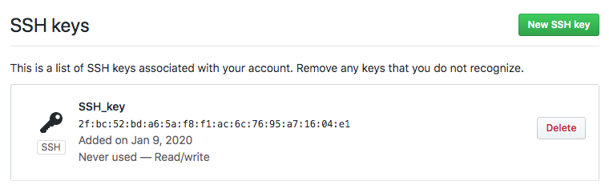

Gitでpushしようとしたらエラーになりました。

## エラーメッセージ

ターミナルから返ってきたエラー文は下記の通りです。

```
git@github.com: Permission denied (publickey).
fatal: Could not read from remote repository.

Please make sure you have the correct access rights
and the repository exists.
```

リモートリポジトリが読み込めず、アクセス権を作成してくださいとのことでした。

## 解決方法

SSH key（公開鍵）を登録、もしくは再設定するとpushできるようになるとの事でしたので試してみました。
### 登録の流れ

 - 公開鍵の生成
 - 公開鍵をコピー
 - GItHubにペーストして登録


### SHHコマンドとは？

<blockquote>SSHは暗号技術を使い、リモートホストで安全にコマンドを実行するためのプロトコルで、「ssh」はそのプロトコルを利用してリモートサーバーを遠隔操作するコマンドです。

<a href="https://www.atmarkit.co.jp/ait/articles/1503/23/news004.html">@IT</a></blockquote>

SHHコマンドを使えば、リモートホスト（SSHサーバー）にログインできるようになるとの事です。
なるほど、勉強になりました。

### SHH Keys（公開鍵）の設定方法

.sshディレクトリに移動して、

```
$ cd ~/.ssh
```

コマンドを実行します。

```
$ ssh-keygen
```

id_rsa.pubにpublic key（公開鍵）が生成されます。

```
Generating public/private rsa key pair.
Enter file in which to save the key (/Users/xxxx/.ssh/id_rsa): 
/Users/xxxx/.ssh/id_rsa already exists.
Overwrite (y/n)? y
Enter passphrase (empty for no passphrase): 
Enter same passphrase again: 
our identification has been saved in /Users/xxxx/.ssh/id_rsa.
Your public key has been saved in /Users/xxxx/.ssh/id_rsa.pub.
```

pbcopyのコマンドでコピーして、

```
$ pbcopy &lt; ~/.ssh/id_rsa.pub
```

GitHubのsetting画面から「New SSH」で公開鍵をペーストします。
公開鍵が正しければ、以下の画面になります。



公開鍵が間違っていると、下記のエラーが返ります。
Key is invalid. You must supply a key in OpenSSH public key format.

下記のコマンドをうって、

```
$ ssh -T git@github.com
```

successfully authenticatedを返ってくれば、登録が成功しています。

```
Enter passphrase for key '/Users/xxxx.ssh/id_rsa':
Hi user-name! You've successfully authenticated, but GitHub does not provide shell access.
```

Google翻訳してみると、
「認証に成功しましたが、GitHubはシェルアクセスを提供しません。」との事。

シェルアクセスはできませんが、SSHアクセスはできるようになりました。