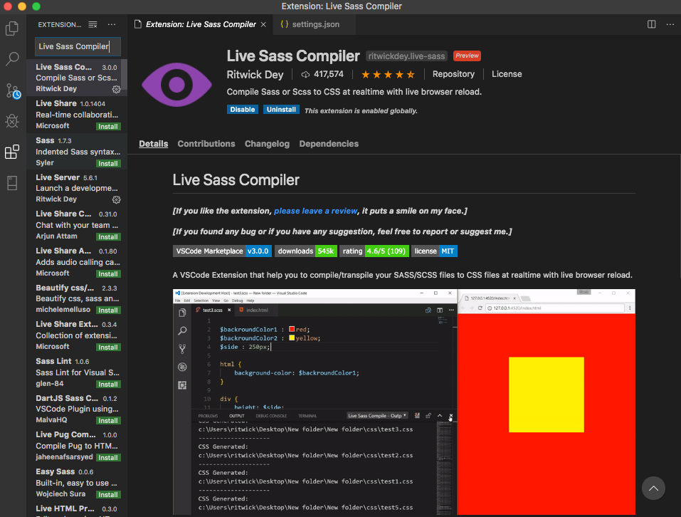

CSSを普通に書いていると縦にドンドン長くなって見にくい…。

実務ではCSSの70%以上が「sass」で書かれているとの情報を見て、上記の悩みもあって「sass」を導入することに決めました。

「sass」はCSSにコンパイルする必要がありますが、gulpなどのタスクランナーをインストールして設定したり、nodeのバージョンとの組み合わせを管理するのは手間です。

そこで便利なのが、VSCodeのプラグイン「Live Sass Compiler」です。

## できること（機能）

簡単に機能をまとめると下記の通りです。

 - 保存後にsassをCSSに自動コンパイル
 - 指定フォルダに生成
 - CSSの生成フォーマット選択
 - その他

インストールするだけで簡単に使えるので、「とりあえずsassが使いたい」という方におすすめです。

別のVSCodeプラグインの「Live Server」と組み合わせれば、

sassを変更→自動保存→CSS自動生成（変更）→ブラウザ自動リロード

といった流れをVSCodeのみで実現可能です。

## Live Sass Compilerの使用方法下記に使い方を簡単に書いておきます。

### インストール

公式サイトからVSCodeを開くか、サイドバーのアイコンからプラグイン画面を開いて検索するとインストールできます。



### 設定
settings.jsonをさわることで設定を変更できます。

好みがありますが、私は初期設定に下記のように追記しました。

```
{
    "files.autoSave": "afterDelay",
    "editor.fontSize": 18,
    "editor.tabSize": 2,
    "editor.wordWrap": "on",
    "editor.fontFamily": "Ricty Diminished",
    "[php]": {
    
  },
  "workbench.iconTheme": "vscode-icons",
  "window.zoomLevel": -1,
  "terminal.integrated.fontSize": 16,

 // .map.cssの生成
 "liveSassCompile.settings.generateMap": false,

 "liveSassCompile.settings.formats":[

  // css
  {
      "format": "expanded",
      "extensionName": ".css",
      "savePath": "~/../css/"
  },
  // css (minified)
  {
      "format": "compressed",
      "extensionName": ".min.css",
      "savePath": "~/../css/"
  }
]

}

```

CSSフォルダに、通常のCSSと圧縮版の.min.cssが自動生成される設定です。

### コンパイル

一番下の「Watch Sass」をクリックして、


「Watching...」になると自動でCSSが監視されるようになります。

